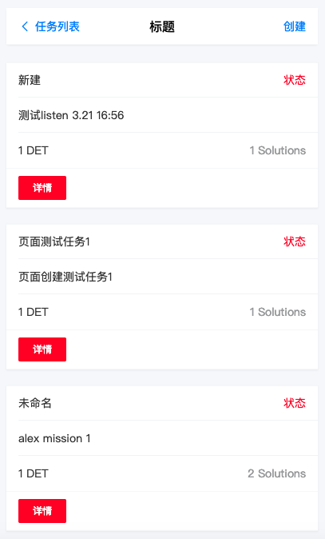

# OpenTask 使用指南

## 0. 整体流程

准备至少2个帐户，我们暂且称作 publisher 和 solver，分别用来发布和解决任务。

1. publisher可以发布任务，发布成功后，会出现在任务列表里；
2. solver浏览任务列表，对感兴趣的任务，提交解决方案；
3. publisher浏览到解决方案，查看审阅，给予接受或拒绝的处理；
4. 如果方案被接受，solver能得到对应的赏金；

## 1. 发布任务

打开网址<http://39.100.36.238/>，会进入首页，是已经发布的任务列表，按时间逆序排列，越近的越靠前。

使用publisher帐户发布任务（注意切换MetaMask帐户）。点击右上角的“创建”，即可发布自己的任务。

输入项目名称和描述，填入具体的悬赏金额（以DET为单位）

点击确认后，会自动唤起MetaMask插件两次，第一次是授信给OpenTask合约相应的金额，第二次是真正的发布到区块链上，供全网播报。

授信的意思是，用私钥签名，授权OpenTask合约相应的额度，可以直接转走花掉，参考信用卡预授权。注意确认网络、帐户、金额。

授信成功后，即开始发布任务到区块链上，这一步会直接扣掉相应的DET（抵押给合约），用于后续结算。注意确认网络、帐户、合约地址。

以上确认完成，几分钟后，列表中就会出现我们发布的新任务，供大家浏览解决，争取悬赏金。

## 2. 解决任务

使用solver解决任务（注意切换MetaMask帐户）。点击列表中的详情，可进入任务详情页。

输入解决方案到文本框中，然后点击“提交解决方案”。同之前发布任务类似，点击按钮会自动呼起MetaMask插件，请求确认交易，点击确认即可。

确认后，解决方案即录入，几分钟等待后，可以在详情页看到该方案。

## 3. 接受或者拒绝任务

使用原发布者publisher地址（注意切换MetaMask帐户），查看任务的解决方案列表，点击accept和reject按钮进行确认或拒绝。点击按钮时，会像之前的操作一样呼起MetaMask插件。点击确认即可。

