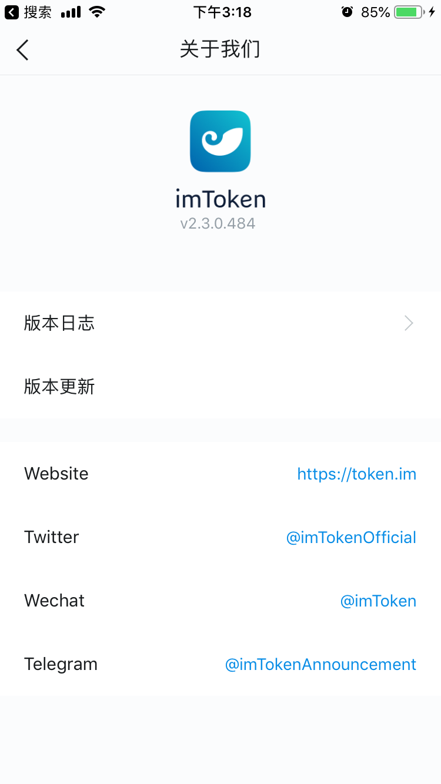
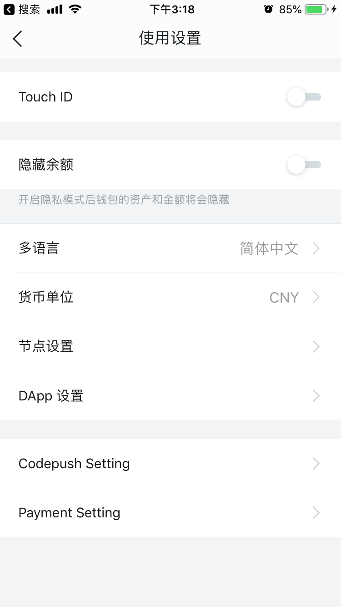
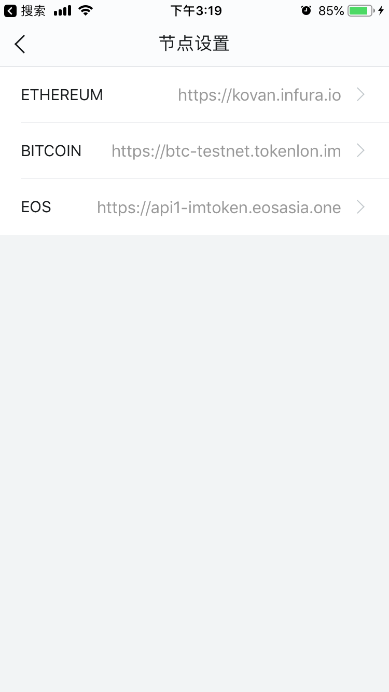
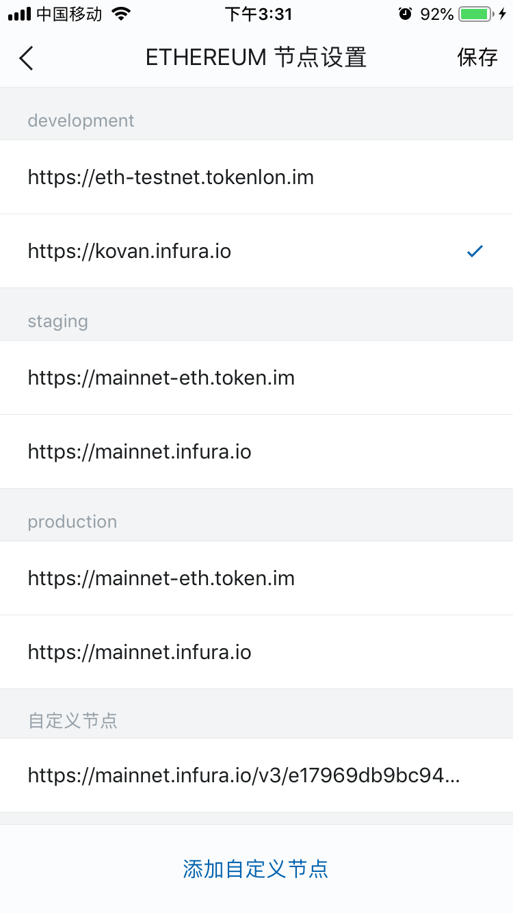

# imToken设置开发者模式

## 开启开发者模式

imToken默认是不能连接测试网络的，必须要开启“开发者模式”。

打开imToken，我->关于我们->连续点击Logo八次，即开启开发者模式。

## 连接测试网络

一旦打开了开发者模式，就可以连接更多的网络，甚至是自定义节点。

按步骤打开，我->使用设置->节点设置->ETHEREUM，选择需要的节点，比如Kovan即可。

