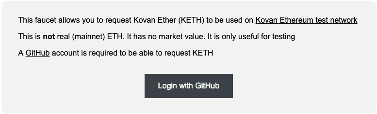
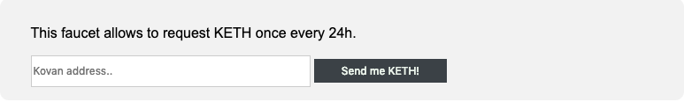
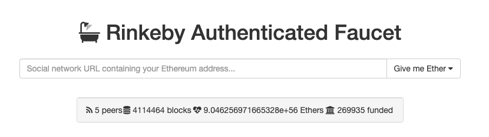
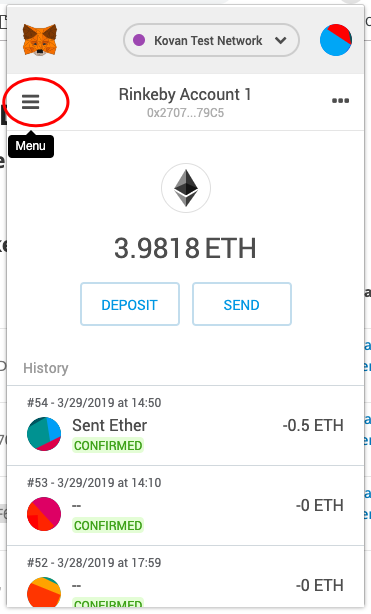
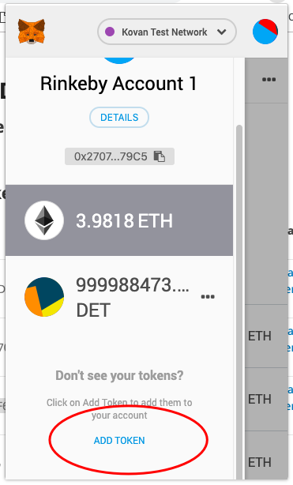
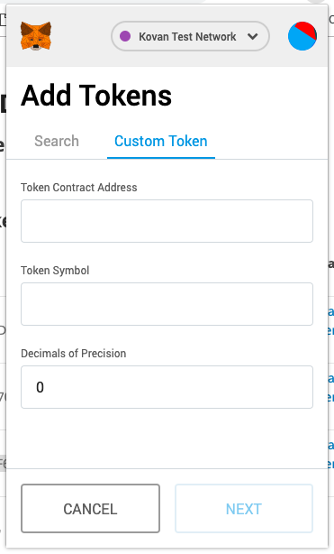
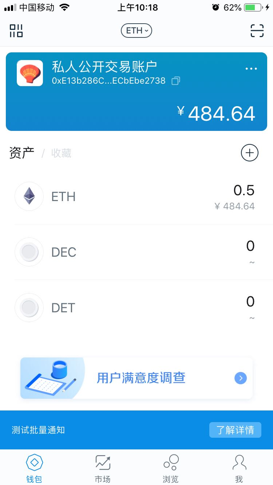
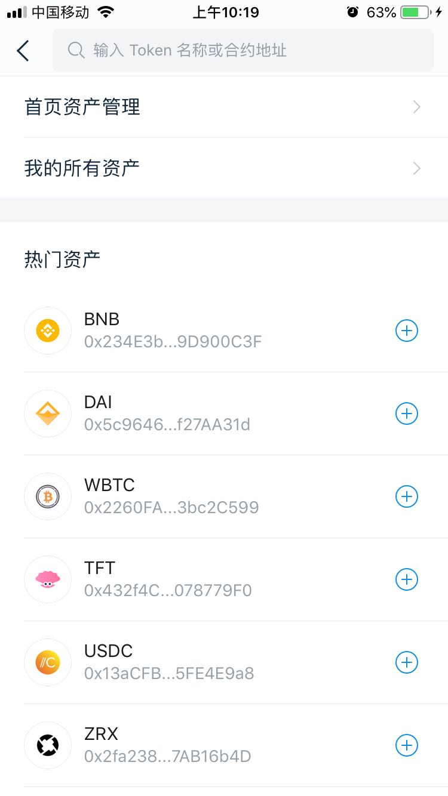
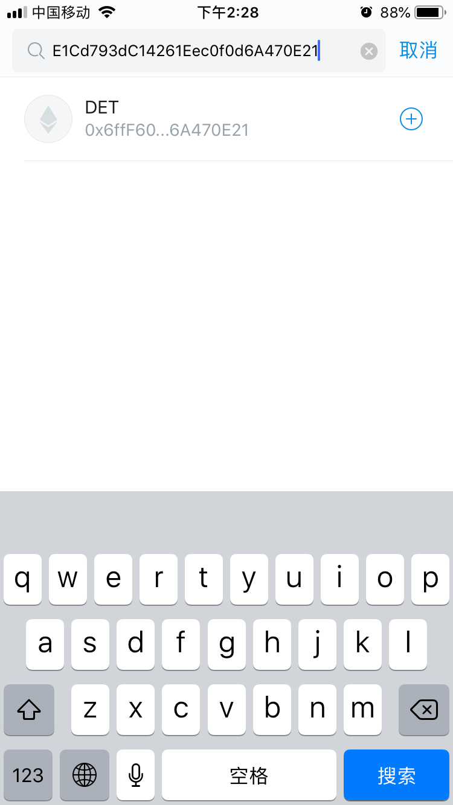
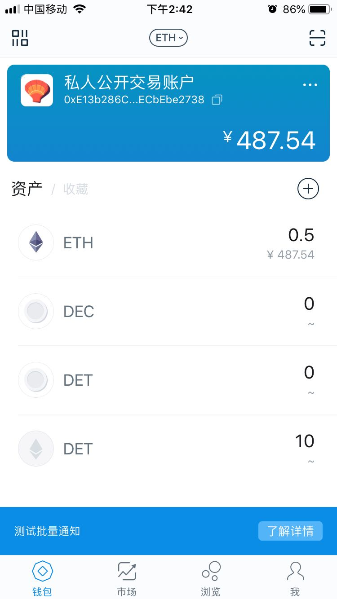

# 开始之前
OpenTask系统构建在以太坊之上，是以太坊公链上的Dapp，因此，使用OpenTask（尤其是发布和解决任务）需要支付少量的Ether（以太币）。同时，发布任务需要抵押DET。

以下假设用户已经有以太坊钱包地址。imToken连接Kovan的办法看[这里](imToken.md)。

## 准备Ether

### 1. Kovan测试网领取免费Ether

打开网址 <https://faucet.kovan.network/>

填上自己的以太坊地址即可

发往的免费Ether会马上到账。

### 2. Rinkeby测试网络领取免费Ether

Rinkeby领取的方式与Kovan类似，地址是<https://faucet.rinkeby.io/>，只不过要首先把地址发布到社交网络(facebook/twitter)上，然后贴的也是社交网络地址，而不是直接贴以太坊地址。

### 3. 找我们领取免费Ether

无论哪个测试网络，都可以私信我们，领取少量的Ether，用于测试OpenTask功能。

## 准备DET

领取对应网络的DET，找Chole和Alex。

如果默认情况下钱包没有出现DET的余额，不用担心，自助添加以下即可。

## MetaMask 查看 DET

仍以Kovan网络为例，DET地址为 0x6ffF60A882CE1Cd793dC14261Eec0f0d6A470E21。其他网络的DET地址，请参考这里<https://dececo.github.io/docs/>。

1. 点击菜单

如果添加过DET，会自动出现DET的余额，如下图我的截图所示。

2. 点击"Add Token"

如果没有，说明没添加过DET，那就点击添加。

3. 填写信息

- **Token Contract Address**: DET的地址，Kovan网络填0x6ffF60A882CE1Cd793dC14261Eec0f0d6A470E21。其他网络的DET地址，请参考这里<https://dececo.github.io/docs/>
- **Token Symbol**: DET
- **Decimals of Precision**: 18

## imToken 查看 DET

仍以Kovan网络为例，DET地址为 0x6ffF60A882CE1Cd793dC14261Eec0f0d6A470E21。其他网络的DET地址，请参考这里<https://dececo.github.io/docs/>。

开始前，请确保[imToken切换到Kovan网络](imToken.md)。

1. 打开imToken，点击资产旁边的加号

2. 输入合约地址

0x6ffF60A882CE1Cd793dC14261Eec0f0d6A470E21

3. 添加DET

输入合约地址后，会自动出现DET合约，点击右边的加号，会添加到首页资产。

如果有主网的DET币已经添加，可能会出现重复的DET，是正常的。因为我们分别在主网、Rinkeby、Kovan均发行了DET币，名字是一致的。

## 地址参考页

其他网络的DET地址，请参考这里<https://dececo.github.io/docs/>。